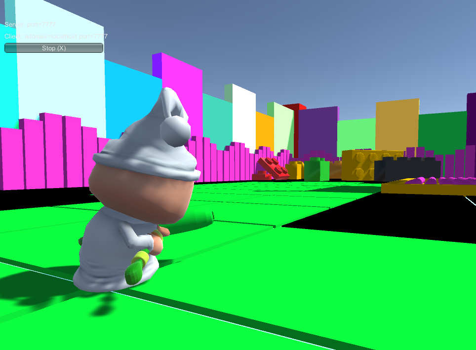

# Unity5-Multiplayer3DGame

This 3D multiplayer game like "Splatoon". Player have a paint color assigned randomly. Game object is to paint everything you see around while you paint you also compete with other players who can paint over your color so you need to be smart and fast!

## Technology used
    
- Unity 5 was used to create it. 
- Unity 5 UNET used for multiplayer functionality. 
- Blender was used to make a paint roller.

## ScreenShot
Main scene:

ScreenShot one

ScreenShot two
